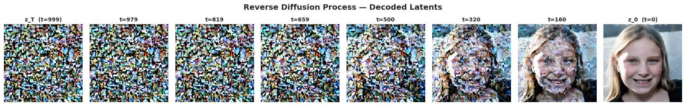
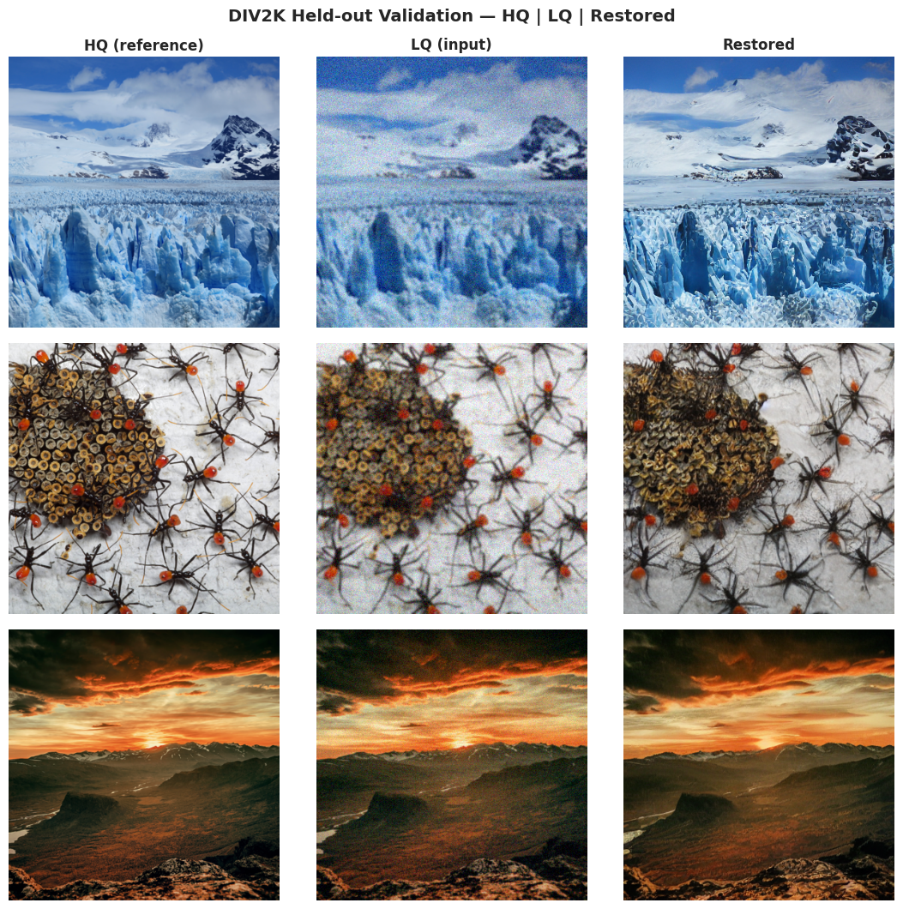
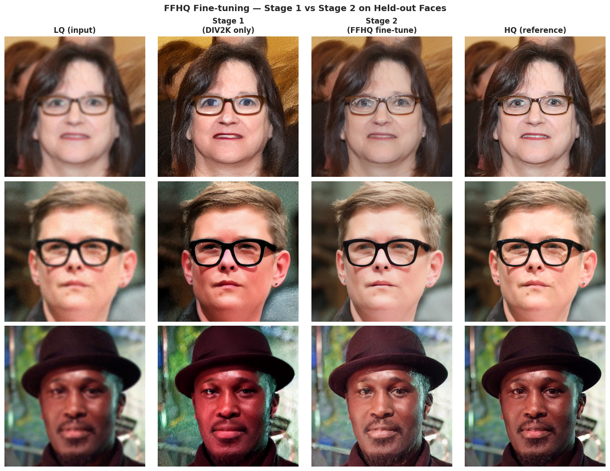

# Image Enhancement Tool

A latent-diffusion–based image restoration pipeline that takes a low-quality
(blurry, noisy) input image and produces a clean, high-resolution output. The
core of the system is a **ControlNet** conditioning network attached to a
frozen **Stable Diffusion v1.5** backbone, trained first on natural images
(DIV2K) and then fine-tuned on faces (FFHQ) for portrait restoration.


---

## 1. Overview

Classical super-resolution / denoising CNNs (see [notebooks/cnn.ipynb](notebooks/cnn.ipynb))
learn a deterministic LQ → HQ mapping and tend to produce over-smoothed
outputs because the L1/L2 objective collapses the conditional distribution to
its mean. Diffusion models instead learn the full conditional distribution
$p(x_{HQ} \mid x_{LQ})$, which lets us sample plausible high-frequency detail
(skin texture, hair, eye highlights) that a regression CNN cannot recover.

This repo contains two complementary pieces:

| Component | Path | Purpose |
|---|---|---|
| Baseline CNN | [src/ml_engine/](src/ml_engine), [notebooks/cnn.ipynb](notebooks/cnn.ipynb) | Reference encoder–decoder restoration model with W&B sweeps. |
| LDM + ControlNet engine | [src/ldm_controlnet_engine/](src/ldm_controlnet_engine) | Latent diffusion restoration with a trained ControlNet. |


### Key terms

- **Diffusion.** A generative process that learns to turn random noise into
  an image by reversing a gradual "add noise" corruption. Training shows the
  model an image with a known amount of static and asks it to predict the
  static; at inference, it starts from noise and removes a little bit at a
  time over many steps until a clean image emerges.
- **Latent space.** A compressed numerical representation of an image
  produced by a pretrained autoencoder (VAE). Instead of working on the full
  $256 \times 256 \times 3$ pixel grid, we work on a $4 \times 32 \times 32$
  tensor that preserves the image's content but is ~48× smaller — making
  diffusion fast enough to train on a single GPU.
- **UNet.** The neural network that does the denoising at each diffusion
  step. It has a U-shaped encoder–decoder shape with skip connections, so it
  can mix global context (what the scene is) with local detail (edges,
  texture). It takes a noisy latent plus the timestep $t$ and predicts the
  noise to subtract.
- **ControlNet.** A small "side" network bolted onto a frozen pretrained
  UNet that injects an extra conditioning signal — in our case, the
  low-quality input image. It tells the UNet *what scene to reconstruct*
  while leaving Stable Diffusion's pretrained weights untouched, which
  makes training cheap and stable (Zhang et al., 2023).

---

## 2. The diffusion pipeline

The model learns to clean up images by playing a game in reverse.
During training we take a sharp picture, gradually add random static until
it's pure noise, and teach a network to guess what static was added at each
step. At inference, we hand it a blurry/noisy photo and say "pretend this is
a half-finished cleanup — finish the job," and it iteratively scrubs the
noise away. Two tricks keep this fast and useful:

1. **Latent space.** All the noise/denoise work happens on a compressed
   "summary" of the image (a $4 \times 32 \times 32$ latent from a pretrained
   VAE), not on full pixels.
2. **ControlNet.** A small add-on network looks at the messy input and tells
   the main model *what scene* it's supposed to be reconstructing.

### 2.1 Latent diffusion

**The forward process** slowly corrupts a clean image $x_0$ into pure noise
over $T$ steps by adding a tiny bit of Gaussian noise each step. There's a
handy closed form that lets us jump directly to any step $t$:

$$
q(x_t \mid x_0) = \mathcal{N}\!\left(x_t;\; \sqrt{\bar\alpha_t}\, x_0,\; (1-\bar\alpha_t) I\right).
$$

Here $\bar\alpha_t$ shrinks from $\approx 1$ (clean) toward $0$ (pure noise)
as $t$ grows — so $x_t$ is just "image plus a known amount of noise." The
network $\epsilon_\theta(x_t, t)$ is trained to **predict that noise**, with
the standard DDPM loss (Ho et al., 2020):

$$
\mathcal{L}_{\text{simple}} = \mathbb{E}\!\left[\, \lVert \epsilon - \epsilon_\theta(x_t, t) \rVert_2^2 \,\right].
$$

Following Rombach et al. (2022), the whole process runs in the **latent
space** of a pretrained VAE rather than on pixels:

$$
z_0 = s \cdot \mathcal{E}(x_0), \qquad x_0 \approx \mathcal{D}(z_0 / s),
$$

where $\mathcal{E}, \mathcal{D}$ are the VAE encoder/decoder and
$s = 0.18215$ is the standard Stable Diffusion scaling constant
(see [forward_pass.py](src/ldm_controlnet_engine/training/forward_pass.py#L21)).
A $256 \times 256$ RGB image becomes a $4 \times 32 \times 32$ latent —
~48× fewer values to denoise, which is what makes single-GPU training
feasible.

### 2.2 ControlNet conditioning for restoration

Stable Diffusion normally generates from a *text prompt*, but here we need to
condition on a *degraded image* instead. **ControlNet** (Zhang et al., 2023)
solves this by:

- **Freezing** the pretrained UNet $\epsilon_\theta$.
- Training a small **side network** $\mathcal{C}_\phi$ — a trainable copy of
  the UNet's encoder — that looks at the LQ image and produces residuals.
- **Injecting** those residuals into the frozen UNet's intermediate features.

In other words, the frozen UNet is the "image expert" and ControlNet is a
"hint generator" that nudges it toward the right scene:

$$
\hat\epsilon = \epsilon_\theta\!\big(z_t,\, t;\; \mathcal{C}_\phi(z_{LQ}, t)\big).
$$

The residual heads are `ZeroConv2d` layers (1×1 convs initialized to zero),
so on step 0 of training $\mathcal{C}_\phi$ outputs all zeros and the model
behaves *exactly* like the original Stable Diffusion — training can only
**add** signal, never break the prior. ControlNet's channel widths
`(320, 640, 1280, 1280)` are picked to match SD 1.5's UNet so the residuals
slot in cleanly.

### 2.3 Training objective

Each training step (see [forward_pass.py](src/ldm_controlnet_engine/training/forward_pass.py)):

1. Encode the HQ and LQ images to latents $z_{HQ}, z_{LQ}$.
2. Pick a random timestep $t$ and a random noise $\epsilon$.
3. Build a noisy version of the HQ latent: $z_t = \sqrt{\bar\alpha_t}\, z_{HQ} + \sqrt{1-\bar\alpha_t}\, \epsilon$.
4. Ask the model "given $z_t$ and the LQ hint, what was $\epsilon$?"
5. Loss = MSE between the true noise and the predicted noise:

$$
\mathcal{L}(\phi) = \mathbb{E}\big\lVert \epsilon - \epsilon_\theta(z_t, t;\, \mathcal{C}_\phi(z_{LQ}, t)) \big\rVert_2^2.
$$

Only the ControlNet weights $\phi$ are updated — the VAE and UNet stay
frozen — which is why this fits on a single GPU.

### 2.4 Inference (reverse process)

At inference ([inference/enhance.py](src/ldm_controlnet_engine/inference/enhance.py))
we run the recipe **in reverse**: encode the LQ image to $z_{LQ}$, start from
pure noise $z_T \sim \mathcal{N}(0, I)$, and have the scheduler iteratively
subtract the model's predicted noise from $t = T$ down to $t = 1$:

$$
z_{t-1} = \text{Step}\!\big(\epsilon_\theta(z_t, t;\, \mathcal{C}_\phi(z_{LQ}, t)),\, t,\, z_t\big).
$$

After the loop, decode the final latent back to a pixel image with the VAE:
$x_{\text{out}} = \mathcal{D}(z_0 / s)$. Defaults are 50 DDIM steps with an
empty (zero) text-prompt embedding, since restoration doesn't need text.



---

## 3. Pretrained weights & transfer learning

I did **not** train a diffusion model from scratch. The pipeline reuses the
following components from `runwayml/stable-diffusion-v1-5` on Hugging Face
(see [build_models](src/ldm_controlnet_engine/training/train_controlnet.py#L76)):

| Component | Source | Status |
|---|---|---|
| `AutoencoderKL` (VAE) | `runwayml/stable-diffusion-v1-5`, subfolder `vae` | Frozen |
| `UNet2DConditionModel` | `runwayml/stable-diffusion-v1-5`, subfolder `unet` | Frozen |
| `DDPMScheduler` | `runwayml/stable-diffusion-v1-5`, subfolder `scheduler` | $T=1000$, linear $\beta$ schedule |
| `ControlNet` | Defined in [models/controlnet.py](src/ldm_controlnet_engine/models/controlnet.py) | **Trained from scratch** with zero-init residual heads |

This is transfer learning: SD 1.5's UNet has already
learned a strong prior over natural images from LAION-scale pretraining, and
ControlNet's zero-init design guarantees we start from that prior and only
*add* a restoration-specific signal during training.

---

## 4. Stage 1 — pretraining on DIV2K (general image restoration)

The first training stage targets generic image quality.

- **Dataset:** [`eugenesiow/Div2k`](https://huggingface.co/datasets/eugenesiow/Div2k) (DIV2K HR split, 800 2K-resolution natural images), streamed via `datasets`. A local mirror is expected at `data/kaggle/div2k_hr/`.
- **LQ generation:** synthesized on the fly by [DegradationPipeline](src/ldm_controlnet_engine/data/degradation.py#L83) — a random Gaussian blur (radius $\in [0.2, 1.5]$) followed by additive Gaussian noise (pixel-space $\sigma \in [0, 10]$). This forces the model to learn deblurring and denoising jointly.
- **Crop:** $256 \times 256$ random crops; tensors normalized to $[-1, 1]$.
- **Optimizer:** AdamW, lr $1\mathrm{e}{-4}$, weight decay $1\mathrm{e}{-2}$, gradient clipping at norm $1.0$.
- **Batch / accumulation:** `batch_size=4`, gradient accumulation configurable.
- **Defaults:** see [TrainConfig](src/ldm_controlnet_engine/training/train_controlnet.py#L42).

Output checkpoints are written to `output/controlnet/checkpoint-XXXXXXX/controlnet.pt`,
with a final `output/controlnet/final/controlnet.pt`.

I would encourage you to zoom in on these images to see what the model is generating from the noise.

`

---

## 5. Stage 2 — fine-tuning on FFHQ (face restoration)

The DIV2K-trained ControlNet generalizes reasonably to natural scenes but is
not specialized for human faces, where perceptual quality matters most.
Stage 2 adapts the model to the face domain.

- **Dataset:** [`arnaud58/flickrfaceshq-dataset-ffhq`](https://www.kaggle.com/datasets/arnaud58/flickrfaceshq-dataset-ffhq) (FFHQ, ~52k aligned $1024^2$ portraits) downloaded via `kagglehub` into `data/kaggle/ffhq/`. A 10k-sample subset is used by default — see the FFHQ download cell in [notebooks/cnn.ipynb](notebooks/cnn.ipynb) for the exact subsetting logic, which is reused by the LDM training notebooks.
- **Initialization:** `train(..., resume_from="output/controlnet/final/controlnet.pt")` — the Stage 1 weights are loaded and training continues, rather than re-initializing the ControlNet (see [train()](src/ldm_controlnet_engine/training/train_controlnet.py#L201)).
- **Same loss, same degradation, same backbone** — only the dataset changes. The frozen SD 1.5 VAE + UNet stay frozen; only $\phi$ is updated.
- **Why this works:** the SD 1.5 UNet already encodes a rich face prior (it was trained on web-scale data containing many portraits). The ControlNet only has to learn *"map blurry/noisy face latents to the conditioning that steers this prior toward the clean face manifold"* — a much smaller learning problem than training a face restorer from scratch.



---

## 6. Repository layout

```
src/ldm_controlnet_engine/
  models/
    controlnet.py         # ControlNet encoder + ZeroConv2d residual heads
    unet_wrapper.py       # Convenience wrapper that injects residuals into the UNet
  data/
    degradation.py        # Gaussian blur + additive Gaussian noise
    dataset.py            # HQToLQDataset + HFStreamingDataset, paired transforms
  training/
    forward_pass.py       # Single-batch loss: encode → noise → predict → MSE
    train_controlnet.py   # TrainConfig, build_models, build_dataloader, train()
  inference/
    enhance.py            # Reverse-process sampler with ControlNet conditioning
notebooks/
  cnn.ipynb               # Baseline CNN restorer (reference)
  ldm_training.ipynb      # Stage 1: DIV2K
  full_ldm_training.ipynb # End-to-end Stage 1 + Stage 2 (FFHQ fine-tune)
  explore_difusion.ipynb  # Scratch / exploration
data/
  kaggle/div2k_hr/        # DIV2K HR images (Stage 1)
  kaggle/ffhq/            # FFHQ portraits (Stage 2, downloaded by notebook)
  samples/                # Hand-picked LQ test portraits
output/controlnet/        # Checkpoints + final weights
```

---

## 7. Quickstart

```bash
# 1. Install
pip install -e ".[dev]"

# 2. (Stage 1) Train on DIV2K
python -c "
from ldm_controlnet_engine.training.train_controlnet import (
    TrainConfig, build_models, build_dataloader, train,
)
cfg = TrainConfig(hq_root='data/kaggle/div2k_hr')
vae, unet, sched, cn = build_models(cfg)
train(cfg, vae=vae, unet=unet, scheduler=sched,
      controlnet=cn, dataloader=build_dataloader(cfg))
"

# 3. (Stage 2) Fine-tune on FFHQ
python -c "
from ldm_controlnet_engine.training.train_controlnet import (
    TrainConfig, build_models, build_dataloader, train,
)
cfg = TrainConfig(hq_root='data/kaggle/ffhq', output_dir='output/controlnet_ffhq')
vae, unet, sched, cn = build_models(cfg)
train(cfg, vae=vae, unet=unet, scheduler=sched, controlnet=cn,
      dataloader=build_dataloader(cfg),
      resume_from='output/controlnet/final/controlnet.pt')
"
```

For interactive use, [notebooks/full_ldm_training.ipynb](notebooks/full_ldm_training.ipynb)
runs both stages end-to-end with progress bars and qualitative previews.

---

## 8. References

- Ho, Jain, Abbeel. *Denoising Diffusion Probabilistic Models*. NeurIPS 2020.
- Song et al. *Denoising Diffusion Implicit Models*. ICLR 2021.
- Rombach et al. *High-Resolution Image Synthesis with Latent Diffusion Models*. CVPR 2022.
- Zhang, Rao, Agrawala. *Adding Conditional Control to Text-to-Image Diffusion Models* (ControlNet). ICCV 2023.
- Karras et al. *A Style-Based Generator Architecture for GANs* (FFHQ dataset). CVPR 2019.
- Agustsson, Timofte. *NTIRE 2017 Challenge on Single Image Super-Resolution* (DIV2K dataset).
