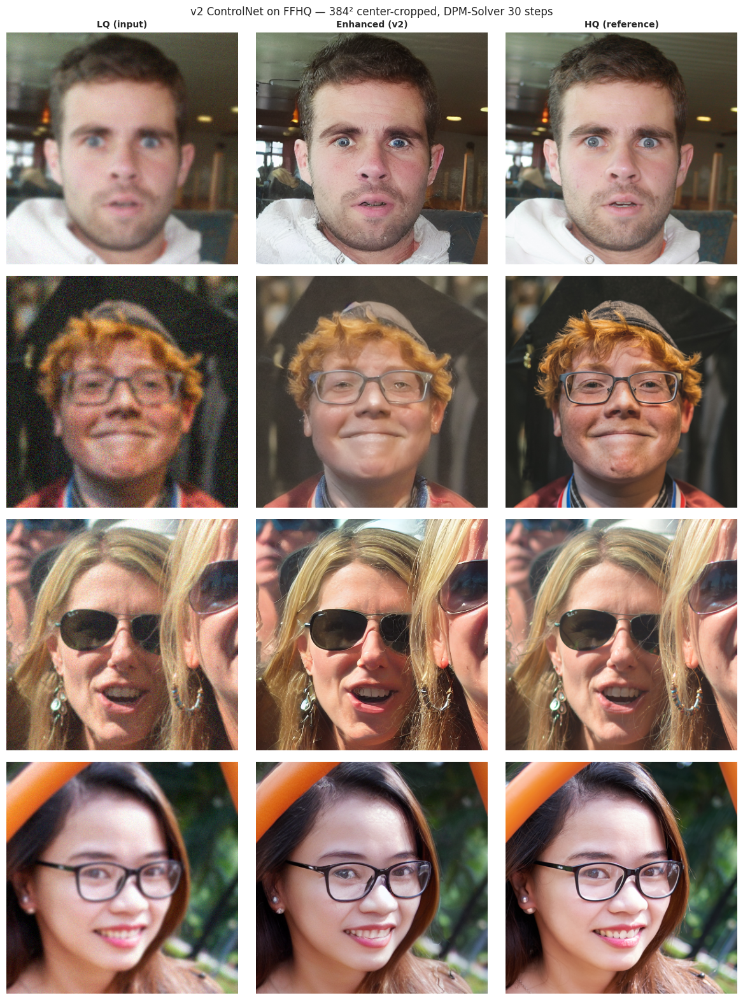
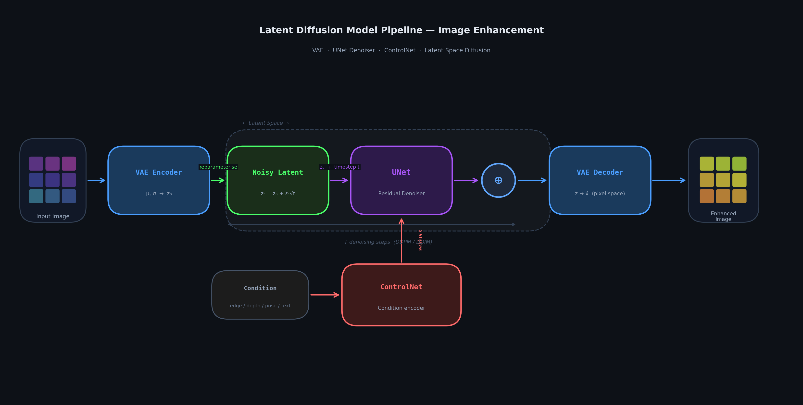

# Image Enhancement Tool

A latent-diffusion–based image restoration pipeline that takes a low-quality
(blurry, noisy) input image and produces a clean, high-resolution output. The
core of the system is a **ControlNet** conditioning network attached to a
frozen **Stable Diffusion v1.5** backbone, trained first on natural images
(DIV2K) and then fine-tuned on faces (FFHQ) for portrait restoration.



---

## 1. Overview

Classical super-resolution / denoising CNNs (see [notebooks/cnn.ipynb](notebooks/cnn.ipynb))
learn a deterministic LQ → HQ mapping and tend to produce over-smoothed
outputs because the L1/L2 objective collapses the conditional distribution to
its mean. Diffusion models instead learn the full conditional distribution
$p(x_{HQ} \mid x_{LQ})$, which lets us sample plausible high-frequency detail
(skin texture, hair, eye highlights) that a regression CNN cannot recover.

This repo contains two complementary pieces:

| Component | Path | Purpose |
|---|---|---|
| Baseline CNN | [src/ml_engine/](src/ml_engine), [notebooks/cnn.ipynb](notebooks/cnn.ipynb) | Reference encoder–decoder restoration model with W&B sweeps. |
| LDM + ControlNet engine | [src/ldm_controlnet_engine/](src/ldm_controlnet_engine) | Latent diffusion restoration with a trained ControlNet. |



---

## 2. The diffusion pipeline

The quick summary of section 2, ignoring the math: the model learns to clean up images by playing a game in reverse. During training, take a sharp picture, slowly add random
static onto it until it's pure noise, and teach a NN to
guess what static was added at each step. Once it's good at that, we can hand
it a blurry, noisy photo and say "pretend this is a half-finished cleanup —
finish the job," and it will iteratively scrub away the noise to reveal a
crisp image. To keep things fast, all of this happens on a compressed
"summary" of the image (a latent) rather than on the full pixels, and a small
add-on network called ControlNet basically hints to the main model what the messy input looks like.

### 2.1 Latent diffusion

A diffusion model defines a Markov forward process that gradually adds Gaussian
noise to a clean sample $x_0$ over $T$ steps:

$$
q(x_t \mid x_{t-1}) = \mathcal{N}\!\left(x_t;\; \sqrt{1-\beta_t}\, x_{t-1},\; \beta_t I\right),
$$

with a closed-form marginal

$$
q(x_t \mid x_0) = \mathcal{N}\!\left(x_t;\; \sqrt{\bar\alpha_t}\, x_0,\; (1-\bar\alpha_t) I\right),
\qquad \bar\alpha_t = \prod_{s=1}^{t}(1-\beta_s).
$$

A network $\epsilon_\theta(x_t, t)$ is trained to predict the noise that was
added, with the simplified DDPM objective from Ho et al. (2020):

$$
\mathcal{L}_{\text{simple}} = \mathbb{E}_{x_0,\, \epsilon \sim \mathcal{N}(0,I),\, t}
\left[\, \lVert \epsilon - \epsilon_\theta(x_t, t) \rVert_2^2 \,\right].
$$

Following Rombach et al. (2022, *High-Resolution Image Synthesis with Latent
Diffusion Models*), I ran the entire forward/reverse process in the latent
space of a pretrained VAE rather than in pixel space:

$$
z_0 = \mathcal{E}(x_0) \cdot s, \qquad x_0 \approx \mathcal{D}(z_0 / s),
$$

where $\mathcal{E}, \mathcal{D}$ are the VAE encoder/decoder and
$s = 0.18215$ is the canonical Stable Diffusion latent scaling constant
(see [forward_pass.py](src/ldm_controlnet_engine/training/forward_pass.py#L21)).
For a $256 \times 256$ RGB input the latent is $4 \times 32 \times 32$, which
is what makes large-image diffusion tractable on a single GPU.

### 2.2 ControlNet conditioning for restoration

Vanilla Stable Diffusion is text-conditioned; It needs to be conditioned on a
degraded image. **ControlNet** formulation (Zhang et al., 2023):
freeze the pretrained UNet $\epsilon_\theta$ and train a *trainable copy of its
encoder*, $\mathcal{C}_\phi$, that takes the conditioning signal and emits
zero-initialized residuals which are added to the UNet's down-block and
mid-block features.

Concretely, the ControlNet ([models/controlnet.py](src/ldm_controlnet_engine/models/controlnet.py))
takes the **VAE-encoded LQ latent** $z_{LQ}$ and the timestep $t$ and produces

$$
\mathcal{C}_\phi(z_{LQ}, t) = \big(\{r^{\text{down}}_i\}_{i=1}^{L},\; r^{\text{mid}}\big),
$$

which are injected into the frozen UNet:

$$
\hat\epsilon = \epsilon_\theta\!\left(z_t,\, t;\; \{r^{\text{down}}_i\},\, r^{\text{mid}}\right).
$$

The output projections are `ZeroConv2d` layers (1×1 conv with zero-initialized
weight and bias), so at step 0 of training the model is *exactly* the original
Stable Diffusion UNet — training only ever adds signal. The channel multipliers
`(1, 2, 4, 4)` and base width `320` are chosen specifically to match SD 1.5's
`block_out_channels = (320, 640, 1280, 1280)` so the residuals are
addition-compatible with the UNet feature maps.

### 2.3 Training objective

For each training step (see [forward_pass.py](src/ldm_controlnet_engine/training/forward_pass.py)):

1. Encode HQ and LQ to latents: $z_{HQ} = s \cdot \mathcal{E}(x_{HQ})$, $z_{LQ} = s \cdot \mathcal{E}(x_{LQ})$.
2. Sample $t \sim \mathcal{U}\{0, \dots, T-1\}$ and $\epsilon \sim \mathcal{N}(0, I)$.
3. Build the noisy target $z_t = \sqrt{\bar\alpha_t}\, z_{HQ} + \sqrt{1-\bar\alpha_t}\, \epsilon$ via the `DDPMScheduler`.
4. Predict $\hat\epsilon = \epsilon_\theta(z_t, t;\, \mathcal{C}_\phi(z_{LQ}, t))$ with the **frozen** UNet and **trainable** ControlNet.
5. Optimize $\phi$ only:

$$
\mathcal{L}(\phi) = \mathbb{E}_{x_{HQ}, x_{LQ}, t, \epsilon}
\big\lVert \epsilon - \epsilon_\theta(z_t, t;\, \mathcal{C}_\phi(z_{LQ}, t)) \big\rVert_2^2.
$$

Because $\mathcal{E}$, $\mathcal{D}$, and $\epsilon_\theta$ are frozen, the
only trainable parameters are the ControlNet weights $\phi$ — roughly an order
of magnitude fewer parameters than the full UNet, which is what makes
single-GPU training feasible.

### 2.4 Inference (reverse process)

At inference time ([inference/enhance.py](src/ldm_controlnet_engine/inference/enhance.py)) encode the LQ image to $z_{LQ}$, initialize $z_T \sim \mathcal{N}(0, I)$ at
the same spatial resolution, and run the standard reverse DDIM/DDPM update for
$t = T, T-1, \dots, 1$:

$$
z_{t-1} = \text{Step}\!\left(\hat\epsilon_t,\, t,\, z_t\right),
\qquad \hat\epsilon_t = \epsilon_\theta\!\left(z_t, t;\, \mathcal{C}_\phi(z_{LQ}, t)\right),
$$

before decoding $x_{\text{out}} = \mathcal{D}(z_0 / s)$. default to 50 DDIM
steps with an unconditional (zero) cross-attention context, since this is a
text-free restoration task.

> _Placeholder: grid of intermediate denoising steps ($z_T \to z_0$) for one
> face, decoded back to pixel space._
>
> ``

---

## 3. Pretrained weights & transfer learning

I did **not** train a diffusion model from scratch. The pipeline reuses the
following components from `runwayml/stable-diffusion-v1-5` on Hugging Face
(see [build_models](src/ldm_controlnet_engine/training/train_controlnet.py#L76)):

| Component | Source | Status |
|---|---|---|
| `AutoencoderKL` (VAE) | `runwayml/stable-diffusion-v1-5`, subfolder `vae` | Frozen |
| `UNet2DConditionModel` | `runwayml/stable-diffusion-v1-5`, subfolder `unet` | Frozen |
| `DDPMScheduler` | `runwayml/stable-diffusion-v1-5`, subfolder `scheduler` | $T=1000$, linear $\beta$ schedule |
| `ControlNet` | Defined in [models/controlnet.py](src/ldm_controlnet_engine/models/controlnet.py) | **Trained from scratch** with zero-init residual heads |

This is transfer learning: SD 1.5's UNet has already
learned a strong prior over natural images from LAION-scale pretraining, and
ControlNet's zero-init design guarantees we start from that prior and only
*add* a restoration-specific signal during training.

---

## 4. Stage 1 — pretraining on DIV2K (general image restoration)

The first training stage targets generic image quality.

- **Dataset:** [`eugenesiow/Div2k`](https://huggingface.co/datasets/eugenesiow/Div2k) (DIV2K HR split, 800 2K-resolution natural images), streamed via `datasets`. A local mirror is expected at `data/kaggle/div2k_hr/`.
- **LQ generation:** synthesized on the fly by [DegradationPipeline](src/ldm_controlnet_engine/data/degradation.py#L83) — a random Gaussian blur (radius $\in [0.2, 1.5]$) followed by additive Gaussian noise (pixel-space $\sigma \in [0, 10]$). This forces the model to learn deblurring and denoising jointly.
- **Crop:** $256 \times 256$ random crops; tensors normalized to $[-1, 1]$.
- **Optimizer:** AdamW, lr $1\mathrm{e}{-4}$, weight decay $1\mathrm{e}{-2}$, gradient clipping at norm $1.0$.
- **Batch / accumulation:** `batch_size=4`, gradient accumulation configurable.
- **Defaults:** see [TrainConfig](src/ldm_controlnet_engine/training/train_controlnet.py#L42).

Output checkpoints are written to `output/controlnet/checkpoint-XXXXXXX/controlnet.pt`,
with a final `output/controlnet/final/controlnet.pt`.

> _Placeholder: a few DIV2K validation triplets — HQ | LQ | restored._
>
> ``

---

## 5. Stage 2 — fine-tuning on FFHQ (face restoration)

The DIV2K-trained ControlNet generalizes reasonably to natural scenes but is
not specialized for human faces, where perceptual quality matters most.
Stage 2 adapts the model to the face domain.

- **Dataset:** [`arnaud58/flickrfaceshq-dataset-ffhq`](https://www.kaggle.com/datasets/arnaud58/flickrfaceshq-dataset-ffhq) (FFHQ, ~52k aligned $1024^2$ portraits) downloaded via `kagglehub` into `data/kaggle/ffhq/`. A 10k-sample subset is used by default — see the FFHQ download cell in [notebooks/cnn.ipynb](notebooks/cnn.ipynb) for the exact subsetting logic, which is reused by the LDM training notebooks.
- **Initialization:** `train(..., resume_from="output/controlnet/final/controlnet.pt")` — the Stage 1 weights are loaded and training continues, rather than re-initializing the ControlNet (see [train()](src/ldm_controlnet_engine/training/train_controlnet.py#L201)).
- **Same loss, same degradation, same backbone** — only the dataset changes. The frozen SD 1.5 VAE + UNet stay frozen; only $\phi$ is updated.
- **Why this works:** the SD 1.5 UNet already encodes a rich face prior (it was trained on web-scale data containing many portraits). The ControlNet only has to learn *"map blurry/noisy face latents to the conditioning that steers this prior toward the clean face manifold"* — a much smaller learning problem than training a face restorer from scratch.

Two example portraits are checked in under [data/samples/](data/samples/) for
qualitative validation:

- [data/samples/brian_king.png](data/samples/brian_king.png)
- [data/samples/ryan_koes.jpeg](data/samples/ryan_koes.jpeg)

> _Placeholder: FFHQ fine-tuning before/after — Stage 1 checkpoint vs.
> Stage 2 checkpoint on the same LQ face._
>
> ``

> _Placeholder: enhanced versions of `brian_king.png` and `ryan_koes.jpeg`._
>
> ``

---

## 6. Repository layout

```
src/ldm_controlnet_engine/
  models/
    controlnet.py         # ControlNet encoder + ZeroConv2d residual heads
    unet_wrapper.py       # Convenience wrapper that injects residuals into the UNet
  data/
    degradation.py        # Gaussian blur + additive Gaussian noise
    dataset.py            # HQToLQDataset + HFStreamingDataset, paired transforms
  training/
    forward_pass.py       # Single-batch loss: encode → noise → predict → MSE
    train_controlnet.py   # TrainConfig, build_models, build_dataloader, train()
  inference/
    enhance.py            # Reverse-process sampler with ControlNet conditioning
notebooks/
  cnn.ipynb               # Baseline CNN restorer (reference)
  ldm_training.ipynb      # Stage 1: DIV2K
  full_ldm_training.ipynb # End-to-end Stage 1 + Stage 2 (FFHQ fine-tune)
  explore_difusion.ipynb  # Scratch / exploration
data/
  kaggle/div2k_hr/        # DIV2K HR images (Stage 1)
  kaggle/ffhq/            # FFHQ portraits (Stage 2, downloaded by notebook)
  samples/                # Hand-picked LQ test portraits
output/controlnet/        # Checkpoints + final weights
```

---

## 7. Quickstart

```bash
# 1. Install
pip install -e ".[dev]"

# 2. (Stage 1) Train on DIV2K
python -c "
from ldm_controlnet_engine.training.train_controlnet import (
    TrainConfig, build_models, build_dataloader, train,
)
cfg = TrainConfig(hq_root='data/kaggle/div2k_hr')
vae, unet, sched, cn = build_models(cfg)
train(cfg, vae=vae, unet=unet, scheduler=sched,
      controlnet=cn, dataloader=build_dataloader(cfg))
"

# 3. (Stage 2) Fine-tune on FFHQ
python -c "
from ldm_controlnet_engine.training.train_controlnet import (
    TrainConfig, build_models, build_dataloader, train,
)
cfg = TrainConfig(hq_root='data/kaggle/ffhq', output_dir='output/controlnet_ffhq')
vae, unet, sched, cn = build_models(cfg)
train(cfg, vae=vae, unet=unet, scheduler=sched, controlnet=cn,
      dataloader=build_dataloader(cfg),
      resume_from='output/controlnet/final/controlnet.pt')
"
```

For interactive use, [notebooks/full_ldm_training.ipynb](notebooks/full_ldm_training.ipynb)
runs both stages end-to-end with progress bars and qualitative previews.

---

## 8. References

- Ho, Jain, Abbeel. *Denoising Diffusion Probabilistic Models*. NeurIPS 2020.
- Song et al. *Denoising Diffusion Implicit Models*. ICLR 2021.
- Rombach et al. *High-Resolution Image Synthesis with Latent Diffusion Models*. CVPR 2022.
- Zhang, Rao, Agrawala. *Adding Conditional Control to Text-to-Image Diffusion Models* (ControlNet). ICCV 2023.
- Karras et al. *A Style-Based Generator Architecture for GANs* (FFHQ dataset). CVPR 2019.
- Agustsson, Timofte. *NTIRE 2017 Challenge on Single Image Super-Resolution* (DIV2K dataset).
